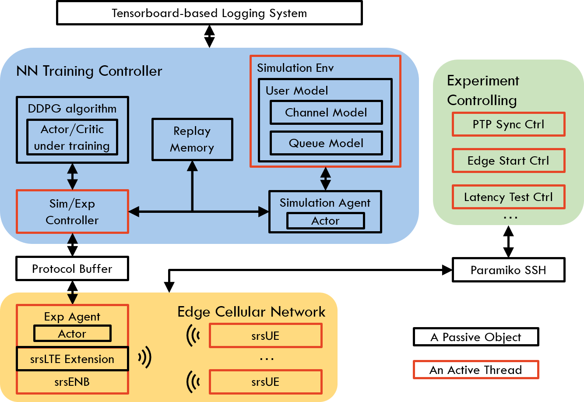
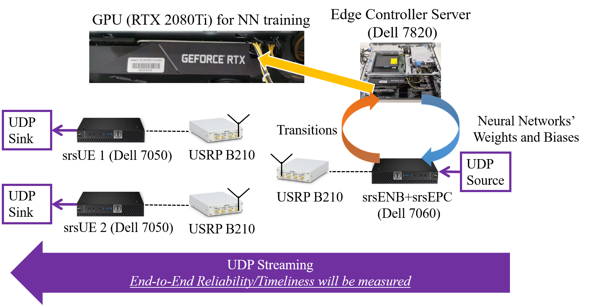
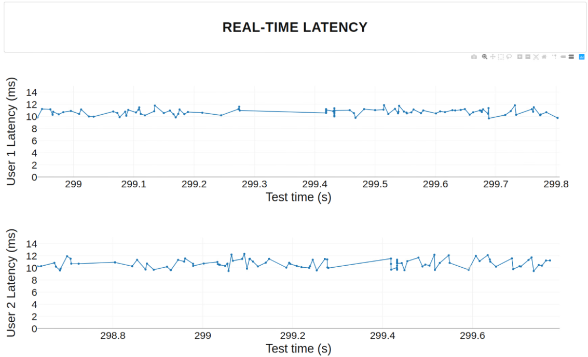

# DRL-5G-Scheduler

Author: Zhouyou Gu (zhouyou.gu@sydney.edu.au); 

Supervisors: Wibowo Hardjawana (wibowo.hardjawana@sydney.edu.au); Branka Vucetic (branka.vucetic@sydney.edu.au)

*This project is developed at [Centre for IoT and Telecommunications](https://www.sydney.edu.au/engineering/our-research/internet-of-things/centre-for-iot-and-telecommunications.html) at The University of Sydney, under a project directly funded by Telstra Corporation Ltd., titled ”Development of an Open Programmable Scheduler for LTE Networks”, from 2018 to 2019. The reference to our paper :*

> ```
> @article{gu2020knowledge,
> title={Knowledge-assisted deep reinforcement learning in {5G} scheduler design: From theoretical framework to implementation},
> author={Gu, Zhouyou and She, Changyang and Hardjawana, Wibowo and Lumb, Simon and McKechnie, David and Essery, Todd and Vucetic, Branka},
> journal={Accepted in IEEE JSAC series on "Machine Learning in Communications and Networks"},
> year={2020}
> }
> ```

### Package Dependency

The following is a table of version-sensitive packages used in this project. Note that packages with different versions may not be functional for this project. Please install the right version based on instructions in their corresponding websites.

| Version-sensitive packages | Version                                  |
| :------------------------- | ---------------------------------------- |
| Ubuntu                     | 18.04.2                                  |
| Python                     | 3.6.9                                    |
| Cmake                      | 3.10.2                                   |
| Protobuf                   | 3.0.0                                    |
| Pytorch                    | 1.8.0+cu111                              |
| Libtorch                   | 1.8.0+cpu+cxx11-ABI                      |
| nvidia-driver (CUDA)       | 450.102.04 (11.0)                        |
| srsLTE                     | c4bcd6e287fc67bf85fb82a41d1f8f2c901ed8d5 |
| UHD                        | UHD_3.14.1.1-release                     |

Install other Linux packages

```bash
sudo apt-get update
sudo apt-get install python3-pip linuxptp ntp linux-lowlatency cmake build-essential libfftw3-dev libmbedtls-dev libboost-program-options-dev libconfig++-dev libsctp-dev libpcsclite-dev python3-pandas iperf
```

Install other Python packages

```bash
sudo pip3 tb-nightly paramiko matplotlib scipy future scp dash
```

### Overall Code Structure



### Off-line training setup

An example of off-line training script is shown in `controller_src/sim_sript_example/ka.py`.  To run this script, execute the following command under `controller_src`, 

```shell
PYTHONPATH=./ python3 ./sim_sript_example/ka.py
```

All logged training information is stored by tensorboard in `controller_src/sim_sript_example/tb-data`. To see the training information, run the follows under `controller_src/sim_sript_example/tb-data`,

```shell
tensorboard --logdir ./ --bind_all
```

Then, use a browser to open the Tensorboad web interface on the port that is shown in the outcome of the above command.

### Online experiment setup

The reference setup of the equipment is shown in the following picture, where all computers are required to be configured with package dependency as listed in the previous section.




In the  edge controller server, download a copy of this project. Then, fetch the srsLTE source code at commit `c4bcd6e287fc67bf85fb82a41d1f8f2c901ed8d5`  and place srsLTE source codes as `edge_src/srsLTE`. After that, switch the working directory to `edge_src` and apply the patch to srsLTE by running

```shell
python3 apply_srslte_patch.py
```

Also, download the libtorch (at the version list in package dependency) in `edge_src` by running

```shell
python3 install_libtorch.py
```

In `controller_src/edge_ctrl_src/edge_config.py`, add the ssh access configurations of the computers, e.g., usernames/passwords/remote working directories. Switch the working directory in the edge controller server to `controller_src` and run

```shell
PYTHONPATH=./ python3 ./edge_ctrl_script/edge_upload_file.py
```

which updates all the source codes to edge computers. Then, have a cup of coffee/tea. After the completion of uploading, run the follows in order to compile the source codes that are uploaded to the edge,

```shell
PYTHONPATH=./ python3 ./edge_ctrl_script/edge_compile.py
```

and have another cup of coffee/tea. After the compilation, run the demo web GUI as

```shell
PYTHONPATH=./ python3 ./edge_ctrl_script/ctrl_web_interface/app.py
```

Open `0.0.0.0:8080` in the browser and click on the button from the top to the bottom to start the experiments: 1) time synchronization, 2) the NN training controller, 3) the srsLTE edge cellular network, 4) ping tests, 5) one-way latency tests in downlink. If you have configured every part correctly, the real-time measured latency will show up in plots at the bottom of web GUI as





The controller here uses pretrained neural networks for 2 users saved in `controller_src/exp_script_example/example_nn`.
